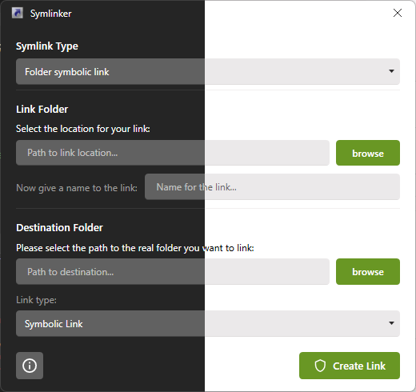

# Symlinker [](https://github.com/amd989/Symlinker/actions/workflows/release.yml)



A simple Windows GUI for creating symbolic links, hard links, and directory junctions — no command line needed.

## Installation

[Download ClickOnce Installer (Supports auto updates)](https://l.alejandro.md/symlinker_clickonce)

[Download Standalone Executable](https://l.alejandro.md/symlinker_executable)

### Scoop

```powershell
scoop bucket add extras
scoop install extras/symlinker
```

## Features

- Create **symbolic links**, **hard links**, and **directory junctions** with a few clicks
- Supports both file and folder link types
- Drag and drop paths directly into the application
- Automatic UAC elevation (administrator privileges required for symlink creation)
- ClickOnce deployment with automatic updates
- Light and dark mode support — syncs with your Windows theme and accent color
- Signed releases for verified authenticity

## Requirements

- Windows 10 or Windows 11
- .NET 8 Runtime

## Building from Source

Prerequisites: [.NET 8 SDK](https://dotnet.microsoft.com/download)

```powershell
dotnet build Symlinker/Symlinker.csproj
dotnet run --project Symlinker/Symlinker.csproj
```

## Contributing

Issues and pull requests are welcome. See [Contributors](https://github.com/amd989/Symlinker/graphs/contributors).

## History

This project has been around since 2009, originally hosted on Google Code and built with Windows Forms. Over the years it has been revived multiple times:

- **2009** — First release, basic folder symlink GUI
- **2010** — Added file symlinks, tooltips, UAC support
- **2015** — Migrated from Google Code to GitHub
- **2025** — Upgraded to .NET 8, dropped support for pre-Windows 10
- **2026** — Migrated from Windows Forms to WPF with a modern UI inspired by WinUI 3, featuring OS theme sync, accent colors, rounded corners, and dark/light mode support

## Featured On

- [Softpedia](https://www.softpedia.com/get/PORTABLE-SOFTWARE/System/System-Enhancements/Portable-Symbolic-Link-Creator.shtml)
- [addictivetips](http://www.addictivetips.com/windows-tips/symlinker-create-symlink-hardlink-and-directory-junction-in-windows/)
- [TecFlap](https://web.archive.org/web/20150511235232/http://www.tecflap.com/2012/05/29/software-day-winautohide-symlinker-hyperdesktop/) (Archived)
- [Zhacks](https://web.archive.org/web/20170512070430/http://www.zhacks.com/easily-create-symbolic-link-with-mklink-gui-symlinker) (Archived)

Previous project link: https://code.google.com/p/symlinker/

## Changelog

See [CHANGELOG.md](CHANGELOG.md)

## License

MIT — see [LICENSE](LICENSE)

## Privacy Policy

See [PRIVACY.md](PRIVACY.md)

## Acknowledgments

Free code signing provided by [SignPath.io](https://about.signpath.io/), certificate by [SignPath Foundation](https://signpath.org/)

Committers and reviewers: [Contributors](https://github.com/amd989/Symlinker/graphs/contributors)
