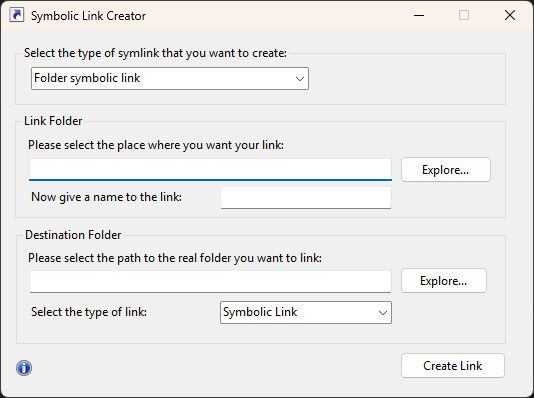

# Symlinker 

## Update from 2025

10 years later and here I come back to revive this app once again... I don't even know if people still use it or they moved on, but hey, it costs nothing to keep it alive...

Upgraded to .net 8 so that means it will only work under windows 10 and above. 

We'll see what time will tell...

## Update from 2015 

Back from the dead. Switched to GitHub instead of Google Code since they are going to close soon.

I will be updating this little app over the course of the next days and hopefully release it in better shape. A lot of people has filed issues with it and I plan to sort them out.

Better late than never some might say. I hope that is not too late for this app to get new light.

## Featured On

* [addictivetips](http://www.addictivetips.com/windows-tips/symlinker-create-symlink-hardlink-and-directory-junction-in-windows/)
* [TecFlap](https://web.archive.org/web/20150511235232/http://www.tecflap.com/2012/05/29/software-day-winautohide-symlinker-hyperdesktop/) (Old)
* [Zhacks](https://web.archive.org/web/20170512070430/http://www.zhacks.com/easily-create-symbolic-link-with-mklink-gui-symlinker) (Old)

Previous Project link
https://code.google.com/p/symlinker/

Downloads
---------
[Download ClickOnce Installer (Supports auto updates)](https://l.alejandro.md/symlinker_clickonce)

[Download Standalone Executable](https://l.alejandro.md/symlinker_executable)

Overview
--------

With this utility you can use the symlink application Microsoft Windows has well hidden inside the cmd.exe app.

The goal is just make it easier to create symbolic links, hard links, or directory junctions, using a pretty simple interface, so no more bogus command line to do it...

This application needs .NET 8 to run and as of **10/18/2025** this software will only work under
* Windows 10
* Windows 11

If you encounter a bug, please let me know in the issues section, I will look into it when I have the time!

Thanks for your downloads and support, hope you like it!

Changelog
---------
See [CHANGELOG.md](CHANGELOG.md)

TODO
----
* Get a real code signing certificate
* Rework the code to be better